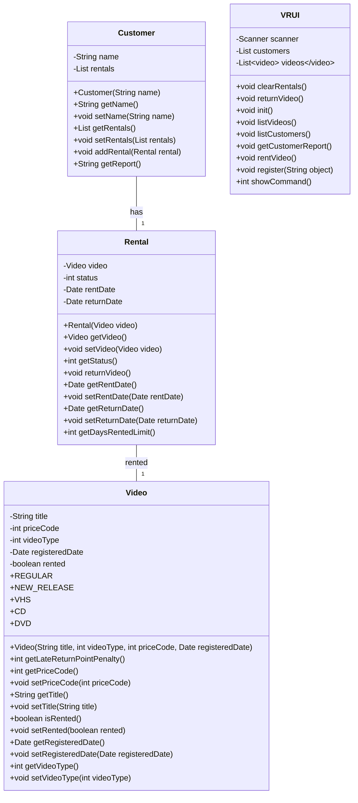

```mermaid
classDiagram
    Customer -- "1" Rental : has
    Rental -- "1" Video : rented

    class Customer {
        -String name
        -List<Rental> rentals
        +Customer(String name)
        +String getName()
        +void setName(String name)
        +List<Rental> getRentals()
        +void setRentals(List<Rental> rentals)
        +void addRental(Rental rental)
        +String getReport()
    }
    class Rental {
        -Video video
        -int status
        -Date rentDate
        -Date returnDate
        +Rental(Video video)
        +Video getVideo()
        +void setVideo(Video video)
        +int getStatus()
        +void returnVideo()
        +Date getRentDate()
        +void setRentDate(Date rentDate)
        +Date getReturnDate()
        +void setReturnDate(Date returnDate)
        +int getDaysRentedLimit()
    }
    class Video {
        -String title
        -int priceCode
        -int videoType
        -Date registeredDate
        -boolean rented
        +Video(String title, int videoType, int priceCode, Date registeredDate)
        +int getLateReturnPointPenalty()
        +int getPriceCode()
        +void setPriceCode(int priceCode)
        +String getTitle()
        +void setTitle(String title)
        +boolean isRented()
        +void setRented(boolean rented)
        +Date getRegisteredDate()
        +void setRegisteredDate(Date registeredDate)
        +int getVideoType()
        +void setVideoType(int videoType)
        +REGULAR
        +NEW_RELEASE
        +VHS
        +CD
        +DVD
    }
    class VRUI {
        -Scanner scanner
        -List<Customer> customers
        -List<Video> videos
        +void clearRentals()
        +void returnVideo()
        +void init()
        +void listVideos()
        +void listCustomers()
        +void getCustomerReport()
        +void rentVideo()
        +void register(String object)
        +int showCommand()
    }


```